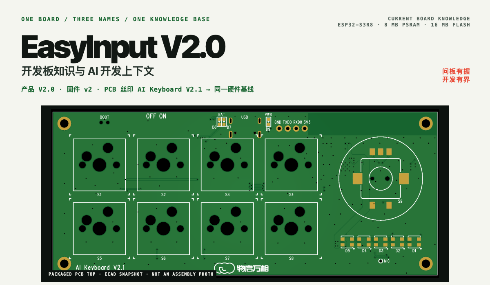
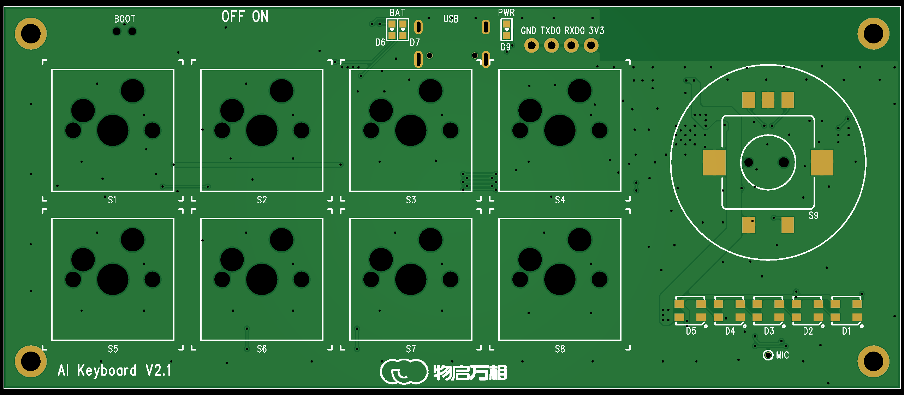
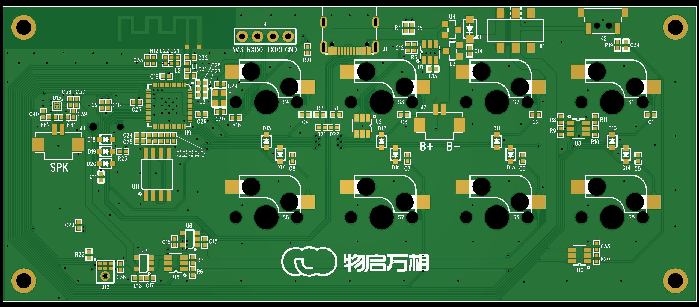
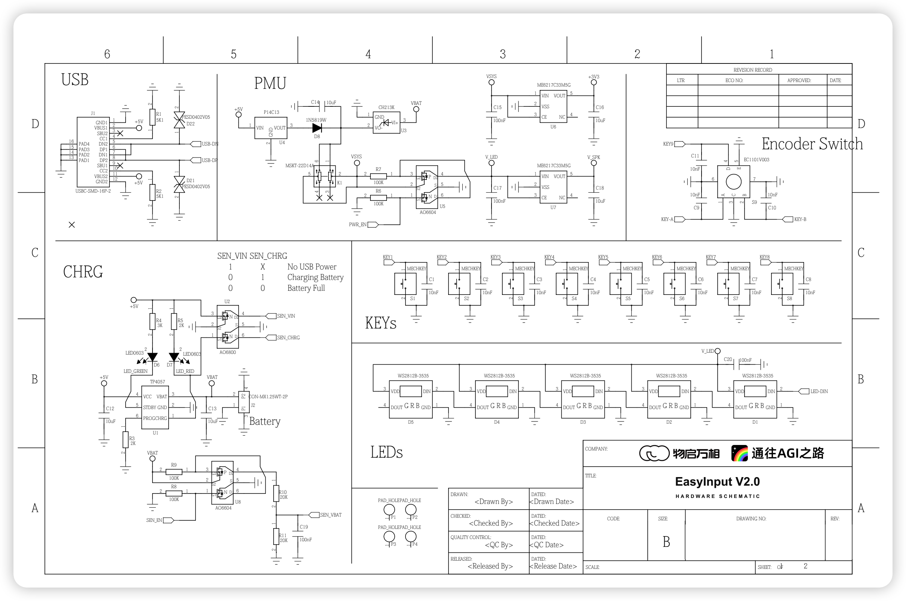
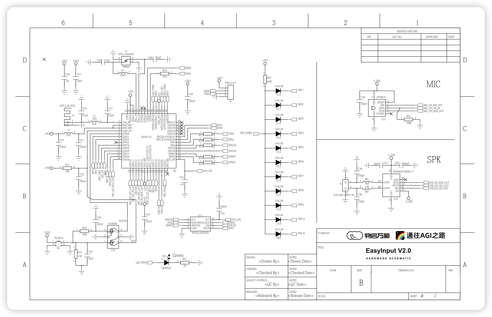
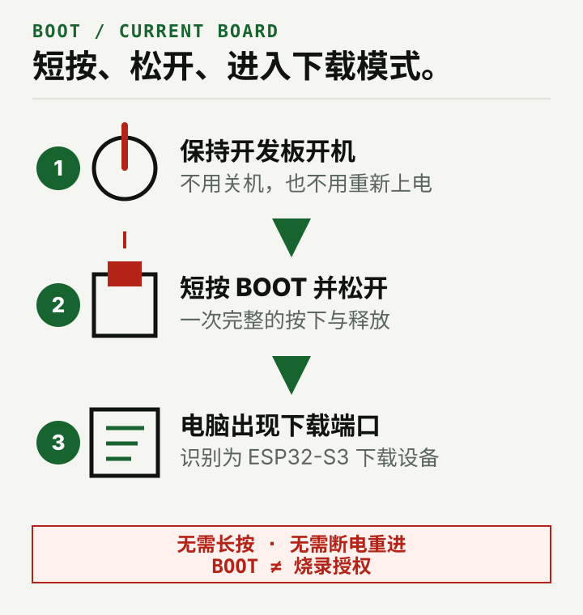
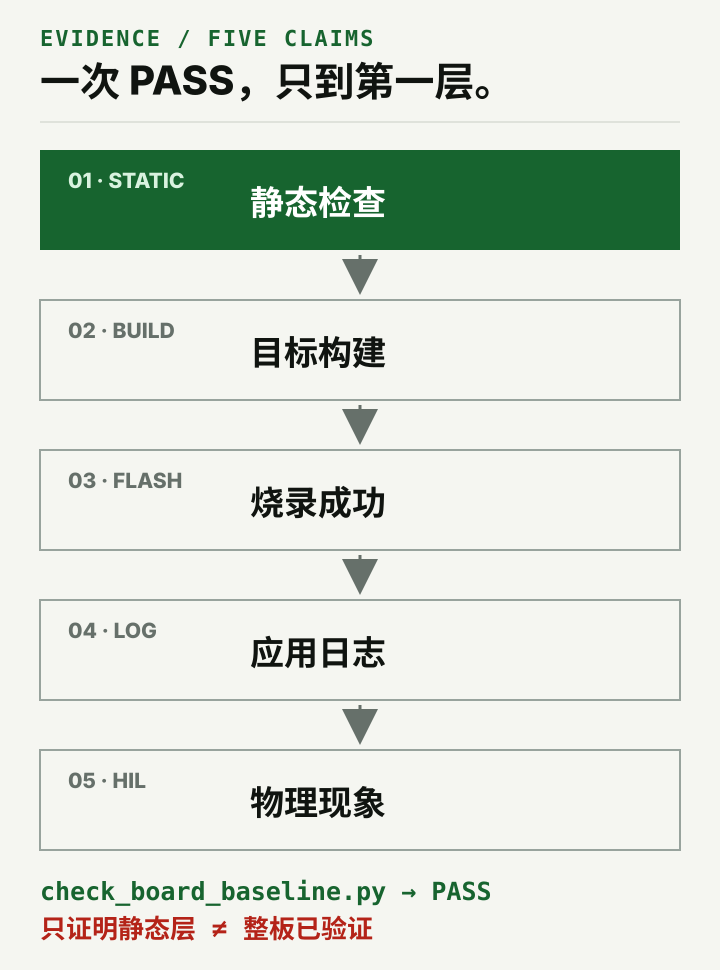
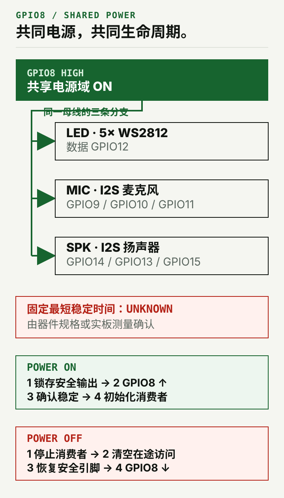

# EasyInput V2.0 开发板知识与 AI 开发上下文

> 面向 `EasyInput V2.0`／固件板型别名 `v2`／PCB 丝印 `AI Keyboard V2.1` 的项目中立开发板知识库、硬件资料与板级安全边界入口。

`easyinput-board-cy` 有两个用途：用户可以直接向它查询当前开发板的身份、GPIO、BOOT、共享电源和板载外设等已确认信息；AI 在其他开发任务中可以先加载这些硬件事实与安全边界，再由目标项目决定具体实现。

它本身不负责创建项目、编写或修改代码、安装工具链、构建、烧录或监视串口。它也不提供任何既有应用的业务默认值，不会因为工作区里存在其他 EasyInput 工程就主动读取或推荐它们。

## 一块板，三个名字

| 使用场景 | 当前名称 | README 中的含义 |
| --- | --- | --- |
| 产品与课程 | `EasyInput V2.0` | 对外使用的产品名 |
| 固件板型 | `v2` / `V2` | 指向当前硬件基线的别名 |
| PCB 丝印 | `AI Keyboard V2.1` | 同一块板上的历史丝印，不是另一套 pinout |

结构件 V25／V26 同样不代表新的电气板版本。看到这些名称时应先归一到当前板级合同，再开始选择引脚或实现项目行为。

## 随 Skill 打包的板级证据

下面是当前 Skill 内保存的 ECAD／PCB 快照，不是装配实拍，也不等同于最终制造资料。点击图片可查看原尺寸。

<table>
  <tr>
    <td width="50%">
      <a href="assets/easyinput-v2-pcb-top.png"></a><br>
      <sub><strong>PCB TOP</strong> · 当前板顶面证据</sub>
    </td>
    <td width="50%">
      <a href="assets/easyinput-v2-pcb-bottom.png"></a><br>
      <sub><strong>PCB BOTTOM</strong> · 当前板底面证据</sub>
    </td>
  </tr>
</table>

<details>
  <summary><strong>展开两页原理图（品牌标题栏版）</strong></summary>
  <p>下面的展示版只在标题栏内增加两方品牌标识与产品标题；元件、网络、页码和标题栏外像素均保持原始快照不变。硬件判断仍以 <a href="assets/easyinput-v2-schematic-page-1.png">第 1 页原始证据</a> 与 <a href="assets/easyinput-v2-schematic-page-2.png">第 2 页原始证据</a> 为准，缩略图里的小字不作为判断依据。</p>
  <p><a href="assets/easyinput-v2-schematic-page-1-branded.png"></a></p>
  <p><a href="assets/easyinput-v2-schematic-page-2-branded.png"></a></p>
</details>

快照日期、来源路径、尺寸和 SHA-256 记录在 [source-manifest.json](references/source-manifest.json)。当前资料缺少最终 BOM、Gerber、装配状态与 DRC／ERC，因此不能据此推断 DNP、量产或整机验证结论。

## 什么时候使用

适合：

- 用户查询或核对当前板的身份、按键、编码器、LED、电池、USB、麦克风、扬声器、唤醒引脚与 BOOT 操作；
- AI 在开发前读取当前板的 GPIO、有效电平、共享电源、保留资源和安全边界；
- 区分不可改变的硬件事实与应由目标项目决定的行为；
- 对已有工程做只读的板级基线扫描，为开发任务提供核对线索；
- 追溯原理图、PCB 快照、历史资料冲突与当前仍未知的项目。

不适合：

- 其他 ESP32-S3 开发板或仅凭芯片通用 pinout 推断硬件；
- 代替开发 Agent 创建工程、编写或修改代码；
- 替目标产品决定按键动作、USB 协议、分区、音频参数或睡眠策略；
- 代替 `esp-idf-cy` 安装工具链、识别设备、烧录和监视串口；
- 在缺少资料时生成最终 BOM、Gerber、DNP 状态或量产结论。

> **许可提醒**：项目自有的 Skill、脚本、测试、文档及其他软件内容采用 [PolyForm-Noncommercial-1.0.0](LICENSE)；[ASSET-LICENSE.md](ASSET-LICENSE.md) 标为 Covered 的资产权利，以及 Mixed 资产中明确标注的项目自有图片版权权益，采用 [CC BY-NC 4.0](ASSET-LICENSE.md)。含 Logo 的 PCB 快照／README 首页头图（Hero）、品牌版原理图和整页预览属于混合资产，不能整文件统一按 CC 使用，其余组成部分沿用各自许可或权利状态。两份许可均限制商业用途，允许的对象、行为和保留义务分别以各自完整正文及 [NOTICE](NOTICE) 为准。本项目属于 source-available，不是 OSI 开源项目，法定合理使用不受影响。

## 30 秒开始

从独立仓库安装时，选择你正在使用的 Agent：

```bash
# Codex
git clone https://github.com/CY-CHENYUE/easyinput-board-cy.git \
  ~/.codex/skills/easyinput-board-cy

# Claude Code（如果使用）
git clone https://github.com/CY-CHENYUE/easyinput-board-cy.git \
  ~/.claude/skills/easyinput-board-cy
```

然后直接说：

```text
使用 easyinput-board-cy，告诉我当前 EasyInput V2.0 的 S1–S8、
编码器和 BOOT 分别是什么，并标明哪些信息仍未知。
```

如果你正让 AI 开发另一个项目，可以这样提供上下文：

```text
先使用 easyinput-board-cy 读取当前板与本次功能有关的硬件事实和安全边界，
再在我指定的项目中继续开发。不要从其他 EasyInput 应用继承业务默认值。
```

此时 `easyinput-board-cy` 负责提供开发板上下文；创建项目、写代码和后续验证仍属于外部开发任务。

第一次正确结果应明确给出：

- `EasyInput V2.0`、`v2` 与 PCB `AI Keyboard V2.1` 是同一块当前硬件基线；
- 与问题或开发任务直接相关的开发板硬件事实、限制及来源；
- 哪些是不可改的硬件事实，哪些仍应由目标项目决定；
- 已知冲突或未知项，不用通用 ESP32 经验补猜测；
- 若使用 checker，只说明只读静态扫描的结果，不把它写成构建、烧录、日志或 HIL 证据。

## 当前板最重要的硬合同

| 对象 | 当前事实 | 不能误写成 |
| --- | --- | --- |
| 主按键 | S1–S8 = GPIO `2, 47, 38, 41, 1, 6, 7, 48`，低有效 | GPIO0 是 S5 |
| 编码器 | A/B/按压 = GPIO `17/16/18` | 两个普通“按住键” |
| BOOT | 开机状态短按并松开一次；退出时关机再开机 | 按住 BOOT 配合上电 |
| 共享电源 | GPIO8 高有效，同时供 LED、麦克风和扬声器 | 只控制灯带的开关 |
| 灯 | 5 颗 WS2812 串联共用 GPIO12 | 5 个独立 GPIO |
| 原生 USB | D-/D+ = GPIO `19/20` | 可随意复用的空闲脚 |
| 音频 | 麦克风 `9/10/11`；扬声器 `14/13/15` | 固定 I2S 控制器或采样率 |
| 唤醒 | KEY_WAKE = GPIO21，只表示有输入触发 | 能直接识别具体按键 |

完整映射只维护在 [pinout.md](references/pinout.md) 和机器可读的 [board-contract.json](references/board-contract.json) 中；README 不建立第二份完整 GPIO 真相源。

## BOOT：当前实板是一按即进



进入下载模式：

1. 保持开发板开机；
2. 短按一次 BOOT 并松开；
3. 等待电脑出现 ESP32-S3 下载端口。

退出下载模式只需关机一次，再正常开机。板上没有供用户操作的独立 RESET/EN 按键。

这个操作来自 2026-08-05 对当前实板的确认，覆盖旧资料中的通用“按住 BOOT 再上电”流程。完整说明见 [BOOT、烧录与恢复](references/boot-flash-recovery.md)。BOOT 只解决进入下载模式，不构成烧录授权。

## 板级事实与项目策略必须分开

| 板级合同负责 | 目标项目负责 |
| --- | --- |
| 开发板身份、SoC、Flash、PSRAM | ESP-IDF 版本与组件依赖 |
| GPIO、方向、有效电平、保留引脚 | 按键动作、编码器方向与交互 |
| GPIO8 共享电源和安全顺序 | 稳定条件资格确认与运行中关断策略 |
| BOOT、USB、板载外设物理连线 | USB 身份、协议、分区、NVS、OTA |
| 原理图、PCB 快照和证据缺口 | 音频格式、I2S 控制器、缓冲与并发 |

没有用户需求或目标项目声明时，右栏内容保持待定义；不要从其他应用、历史日志或常见 ESP32 示例补默认值。详细边界见 [project-boundaries.md](references/project-boundaries.md)。

## 对已有 ESP-IDF 项目做只读核对

Skill 附带一个可选的只读、启发式静态扫描器，用于从已有工程中寻找可能违反当前板级基线的线索：

```bash
python3 scripts/check_board_baseline.py /path/to/esp-idf-project
```



- `FAIL`：扫描器按当前已建模规则发现板级冲突；
- `WARN`：扫描无法确认构建分支、时序或其他风险，需要人工核对；
- `PASS`：未发现已建模冲突，不代表原理图、电气安全、构建或 HIL 已通过。

退出码 `0` 表示没有 `FAIL`（可以仍有 `WARN`），`1` 表示发现板级冲突，`2` 表示命令、路径或合同配置错误。

扫描器不会修改代码、创建工程、构建或操作设备，也不能代替开发者理解真实编译分支。项目可以只使用板载资源的一个子集；没有初始化按键、LED、麦克风或扬声器，不会仅因此失败。

## GPIO8：共享生命周期，不是灯带开关



GPIO8 拉高前，先把下游命令输出锁存到安全状态；共享电源稳定后，才能初始化 WS2812、麦克风和扬声器。当前资料不能证明一个对所有器件、项目和开发板批次都成立的固定最短等待时间。

目标项目必须依据器件规格或实板测量确定自己的稳定条件。运行中若要关断 GPIO8，必须先停止全部共享消费者、清空在途访问并恢复安全引脚状态。完整顺序见 [power-and-peripherals.md](references/power-and-peripherals.md)。

## 证据、冲突与未知项

冲突判断以当前实板明确确认、可复现的板级验证和可追溯原始资料为先。`board-contract.json` 是这些证据的规范化机器索引，不会因为机器可读就获得自证能力；若它与原始证据冲突，应回到来源修订合同。完整顺序与已知被取代关系见 [identity-and-authority.md](references/identity-and-authority.md)。

当前仍未知的内容包括最终 BOM、Gerber／钻孔／贴片文件、DRC／ERC、D19／D20 装配状态、V_LED 电平裕量、GPIO8 电源波形和跨批次最短稳定时间。详见 [known-gaps-and-errata.md](references/known-gaps-and-errata.md)；图片来源、hash 与快照日期记录在 [source-manifest.json](references/source-manifest.json)。

## 推荐的信息使用流程

1. 先确认用户是在查询开发板信息，还是让 AI 为另一个开发任务补充硬件上下文；
2. 识别 `EasyInput V2.0`、`v2` 与 `AI Keyboard V2.1` 指向同一块当前硬件基线；
3. 只读取与问题有关的身份、pinout、BOOT、电源或证据 reference；
4. 输出已确认事实、项目待定项、证据来源和未知项；
5. 如有指定的已有工程，可选运行 baseline checker 做只读启发式核对；
6. 将开发板上下文交还给查询者或外部开发任务，不由本 Skill 继续创建项目、写代码、构建或操作设备。

如果外部开发任务还涉及 ESP-IDF 环境、build、flash、monitor 或设备验身，应另行使用 `esp-idf-cy`。烧录前仍需 fresh 识别芯片与 MAC，并由用户确认具体目标设备；这些结果不能归功于本 Skill。

## 目录

```text
easyinput-board-cy/
├── SKILL.md
├── README.md
├── DESIGN.md
├── LICENSE
├── ASSET-LICENSE.md
├── NOTICE
├── agents/openai.yaml
├── references/
│   ├── identity-and-authority.md
│   ├── pinout.md
│   ├── power-and-peripherals.md
│   ├── boot-flash-recovery.md
│   ├── project-boundaries.md
│   ├── known-gaps-and-errata.md
│   ├── source-map.md
│   ├── source-manifest.json
│   └── board-contract.json
├── assets/
│   ├── easyinput-v2-schematic-page-{1,2}.png
│   ├── easyinput-v2-schematic-page-{1,2}-branded.{svg,png}
│   ├── brand-{wuqiwangxiang,waytoagi}-black.png
│   ├── easyinput-v2-pcb-{top,bottom}.png
│   ├── wechat-qr.jpg
│   └── readme/
├── scripts/check_board_baseline.py
├── tests/
└── evals/evals.json
```

## 验证

```bash
python3 tests/test_check_board_baseline.py
python3 tests/test_skill_contract.py
```

这两组测试验证板级 checker 与 Skill 合同。它们不冒充真机、电气或量产验证。

## 许可与权利边界

从首次包含本许可的版本起，项目自有的 Skill、脚本、测试、文档及其他软件内容采用 [PolyForm-Noncommercial-1.0.0](LICENSE)（SPDX：`PolyForm-Noncommercial-1.0.0`）。许可覆盖协议定义的非商业目的，并允许在该范围内修改和再分发；商业用途需另行取得许可方的书面授权。分发时还须保留 [NOTICE](NOTICE) 中以 `Required Notice:` 开头的声明。本项目因此属于 source-available，不是 OSI 开源项目。这里仅作中文摘要，完整权利与义务以英文许可正文为准。

在 [ASSET-LICENSE.md](ASSET-LICENSE.md) 中标为 Covered 的资产权利，以及 Mixed 资产中明确标注、由许可方拥有或有权许可的项目自有图片版权权益，采用 `CC-BY-NC-4.0`。该许可允许在署名且非商业的条件下分享和改编；品牌 Logo、微信公众号二维码以及许可方无权许可的第三方材料不在这项资产授权内。

含 Logo 的 PCB 快照及其 Hero／审阅渲染、品牌版原理图与整页预览属于混合资产，不作为整文件统一授予 CC 许可；其中的原理图、PCB／说明图、README 文字、页面代码、Logo 与二维码分别沿用各自的许可或权利状态，具体路径和组成边界以 [ASSET-LICENSE.md](ASSET-LICENSE.md) 为准。

换证不追溯：在首次包含本许可的版本之前，已经按 Apache-2.0 发布并取得的版本继续适用其当时的 Apache-2.0 授权，本次换证不撤回既有许可。每个版本以其随附的 `LICENSE` 为准。

品牌名称与 Logo 只用于来源识别和展示，两份许可都不授予商标使用权；第三方材料仍受其各自权利状态约束。原理图与 PCB 快照是当前板级证据，不是完整 ECAD、制造包或量产认证；GPIO、引脚和电气关系等硬件事实也不会仅因图片许可而成为排他权利，基于这些事实独立编写的固件不会仅因参考本 Skill 自动受该许可约束。

## 交流

<div align="center">
  <p>扫码关注公众号，获取更新与交流反馈</p>
  
</div>
